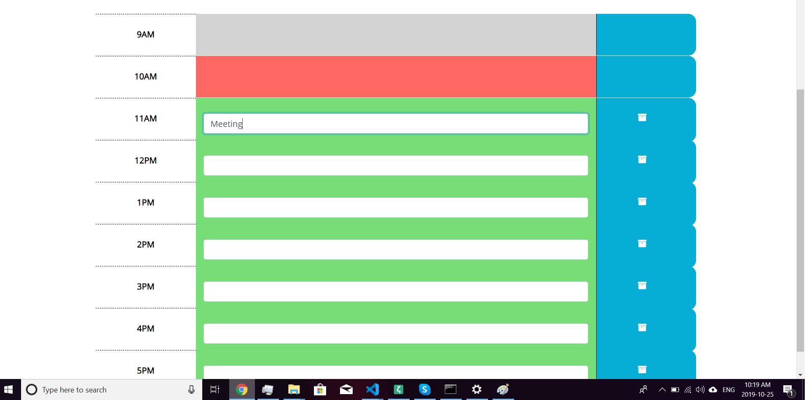
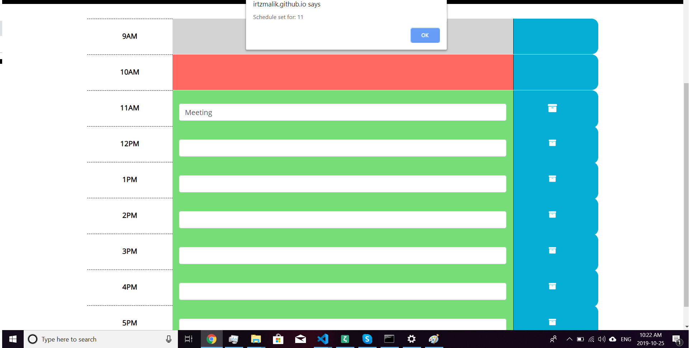
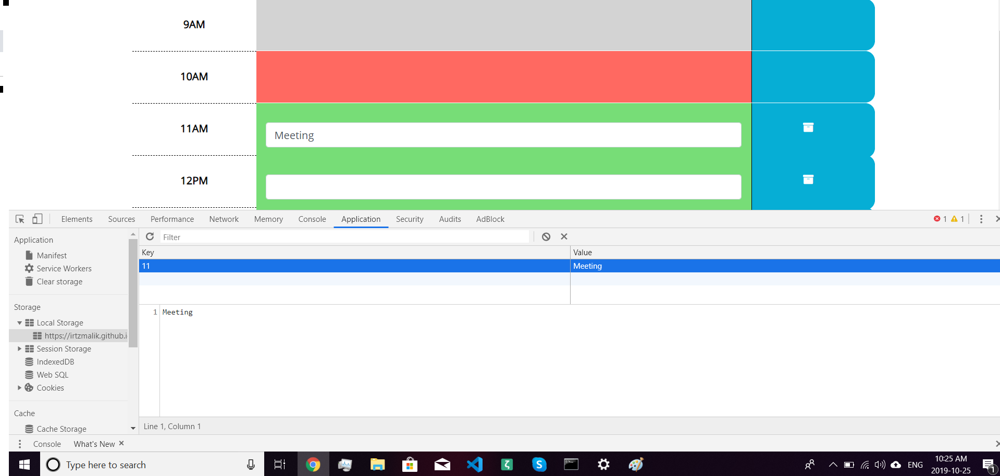
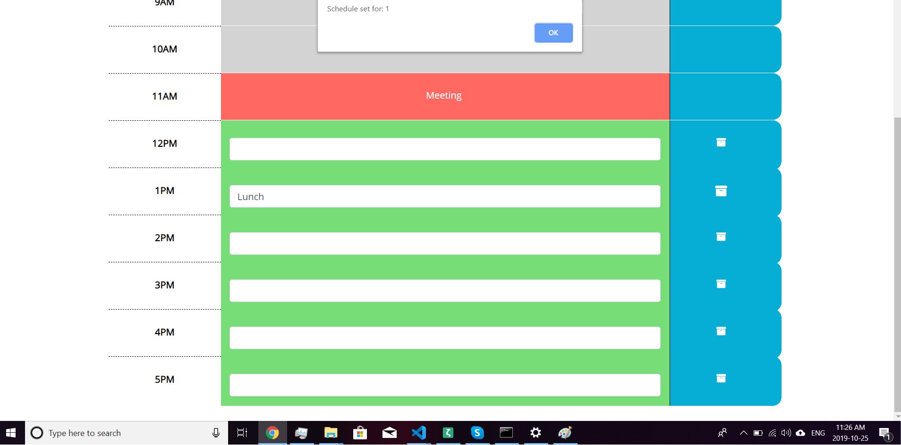
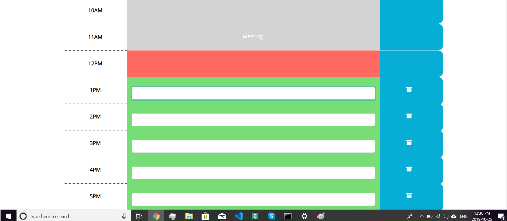

# Day-Planner

This is a day planner it will only run in real time i.e. it will run between 9am - 5 pm time only. If an event is finished it will show grey which means past. If there is an upcoming event then it will show greenwhich means future.  If event is happening it will show in Red which means present. It will store everything on local storage. In order for you to test it you must change your local time on your computer.

## Installation
Git clone the repo on your local computer and open Index.html or use this link below

[https://irtzmalik.github.io/Day-Planner/](<https://irtzmalik.github.io/Day-Planner/>)

## Usage 
Go to Index.html or [https://irtzmalik.github.io/Day-Planner/](<https://irtzmalik.github.io/Day-Planner/>)

Choose Quiz

![Type] (

)

Click on icon & save

![Save] (

)

![Stored] (
)

Current event 

![Current] (

)

Past Event
![Past] (

)

 
